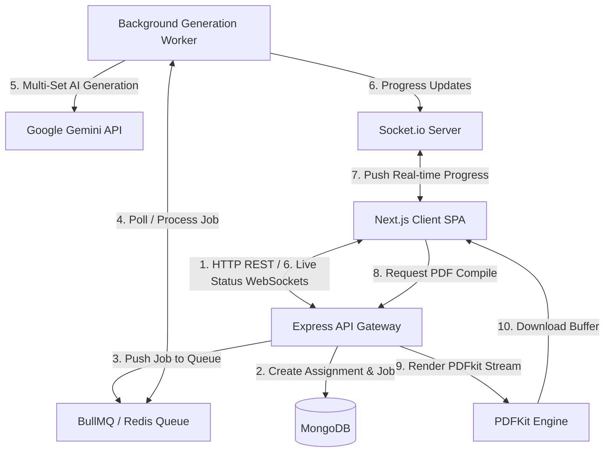

# VedaAI Assessment Creator

VedaAI is an automated, queue-driven AI assessment engine designed for educators to generate structured, syllabus-aligned question papers. It automates the process of building A4-printable question papers across multiple shuffled sets, complete with class headers, difficulty tags, student information fields, and formatted answer keys.

The system is designed with a modern microservices-adjacent architecture: an asynchronous task-queue model that offloads heavy LLM calls to background workers and uses live WebSockets to stream generation progress directly back to the classroom-facing frontend.

---

## System Architecture & Data Flow

VedaAI is designed to prevent server lockups during long-running generative AI tasks. By separating the HTTP request/response cycle from the actual background generation, the API remains highly responsive.

### Architecture Diagram



### End-to-End Flow
1. **Initiation**: The teacher fills out the test parameters (subject, grade, chapter list, question count per section, and additional prompt guidelines) in the Next.js SPA.
2. **Queuing**: The Express API receives the request, inserts a pending `Assignment` record into MongoDB, and schedules a generation task in **BullMQ** (powered by **Redis**). The API returns a `202 Accepted` immediately.
3. **Tracking**: The client listens on a **Socket.io** channel mapped to the assignment's ID.
4. **Execution**: The background **worker** picks up the job, marks status as `processing`, and calls the **Gemini AI service**. It iterates through the required count of shuffled test sets (e.g. Set A, Set B, Set C).
5. **Real-time Streaming**: During generation, the worker updates the job's progress in MongoDB and emits websocket events (e.g., *Preparing... (15%)*, *Writing Set A... (45%)*, *Finalizing... (95%)*).
6. **Delivery & Printing**: Once marked `completed` (100%), the UI presents a split-screen view showing the dynamic web preview and the A4 PDF generation interface. The teacher can customize metadata (Student Name, Roll Number, Date) and compile/download specific sets on demand.

---

## Technical Stack

### Frontend
- **Framework**: Next.js 14 (App Router)
- **State Management**: Zustand
- **Real-Time updates**: Socket.io-client
- **Styling**: Vanilla CSS Modules (Premium dark-mode aesthetics, custom progress bars)
- **Icons**: Lucide React

### Backend
- **Runtime**: Node.js with TypeScript
- **Framework**: Express
- **Task Queue**: BullMQ
- **In-Memory Store**: Redis 7
- **Database**: MongoDB (via Mongoose)
- **Real-Time Engine**: Socket.io (Engine.io)
- **Document Compiler**: PDFKit (custom column and layout arithmetic)

---

## Core Features

- **Multi-Set Test Papers**: Generates multiple distinct variations (Set A, Set B, etc.) of a question paper to minimize cheating in classrooms.
- **A4-Standard PDF Layouts**: Unlike generic HTML-to-PDF libraries, VedaAI implements dynamic column wrapping and item measurement via PDFKit. MCQs align in two or three columns with strict boundary checks to avoid word overlaps.
- **Answer Key Auto-Generation**: Automatically appends a comprehensive answer key at the end of the question paper for rapid grading.
- **Real-time Pipeline**: A full graphical stepper UI showing precisely what the AI is composing at any given millisecond.

---

## Monorepo Layout

```
vedaai/
├── backend/                  # Node.js API & Workers
│   ├── src/
│   │   ├── config/           # Database, Redis & BullMQ Initializers
│   │   ├── models/           # Mongoose schemas (Assignment, Sets)
│   │   ├── routes/           # REST endpoints (/api/assignments)
│   │   ├── services/         # PDFKit Engine, Gemini AI Gateway, Sockets
│   │   ├── workers/          # BullMQ generation task processor
│   │   └── server.ts         # App entrypoint
│   ├── Dockerfile
│   └── package.json
│
├── frontend/                 # Next.js Application
│   ├── src/
│   │   ├── app/              # App router & pages (dashboard, editor)
│   │   ├── components/       # Steppers, Preview modals, Print views
│   │   ├── store/            # Zustand global stores (socket & state handlers)
│   │   └── types/            # TypeScript interfaces
│   ├── Dockerfile
│   └── package.json
│
├── docker-compose.yml        # Orchestrates Redis, MongoDB, Backend & Frontend
└── Makefile                  # Short-cuts for system commands
```

---

## Environment Variables

### Backend Configuration (`backend/.env`)
Create a `.env` file inside `backend/` with the following variables:
```ini
PORT=5000
MONGODB_URI=mongodb://localhost:27017/vedaai
REDIS_URL=redis://localhost:6379
GEMINI_API_KEY=your_gemini_api_key_here
FRONTEND_URL=http://localhost:3000
```

### Frontend Configuration (`frontend/.env.local`)
Create a `.env.local` file inside `frontend/` (only required if running outside Docker):
```ini
NEXT_PUBLIC_BACKEND_URL=http://localhost:5000
```

---

## Installation & Running Locally

Ensure you have **Node.js 20+**, **Docker**, and **Docker Compose** installed.

### Option A: Using Docker Compose (Recommended)
This fires up Redis, the Node backend, the background worker queue, and the Next.js frontend instantly:

```bash
# 1. Clone the repository
git clone https://github.com/isatyamks/vedaai.git
cd vedaai

# 2. Spin up all containers
docker compose up --build -d
```
The application will be accessible at:
- **Frontend**: `http://localhost:3000`
- **Backend API**: `http://localhost:5000/health`

### Option B: Bare-Metal Setup (Development Mode)
If you prefer running services directly:

#### 1. Pre-requisites
Ensure local instances of **MongoDB** and **Redis Server** are active on default ports.

#### 2. Start the Backend & Worker
```bash
cd backend
npm install
npm run dev
```

#### 3. Start the Frontend
```bash
cd frontend
npm install
npm run dev
```
Navigate your browser to `http://localhost:3000`.

---

## Production Deployment & Nginx Reverse Proxy

When deploying on cloud providers (like **AWS EC2**), it is recommended to run Nginx as a reverse proxy on the host system to route traffic securely to the internal Docker containers.

> [!NOTE]
> Nginx is **not** included inside the repository or Docker Compose stack itself. Instead, it runs directly on the host OS (e.g., Ubuntu EC2 instance) as a system service (`sudo apt install nginx`). This architecture isolates routing, makes port bindings secure, and simplifies SSL/HTTPS configuration using Let's Encrypt (Certbot).

### Nginx Block Configuration (`/etc/nginx/sites-available/vedaai`)
This maps port 80 traffic to the internal frontend (port 3000) and routes `/api` and `/socket.io` to the internal API (port 5000):

```nginx
server {
    listen 80;
    server_name your_domain_or_server_ip;

    # Next.js SPA
    location / {
        proxy_pass http://localhost:3000;
        proxy_http_version 1.1;
        proxy_set_header Upgrade $http_upgrade;
        proxy_set_header Connection 'upgrade';
        proxy_set_header Host $host;
        proxy_cache_bypass $http_upgrade;
    }

    # REST APIs
    location /api/ {
        proxy_pass http://localhost:5000;
        proxy_http_version 1.1;
        proxy_set_header Host $host;
        proxy_set_header X-Real-IP $remote_addr;
        proxy_set_header X-Forwarded-For $proxy_add_x_forwarded_for;
        proxy_set_header X-Forwarded-Proto $scheme;
    }

    # WebSocket Streams (Socket.io)
    location /socket.io/ {
        proxy_pass http://localhost:5000;
        proxy_http_version 1.1;
        proxy_set_header Upgrade $http_upgrade;
        proxy_set_header Connection "Upgrade";
        proxy_set_header Host $host;
        proxy_set_header X-Real-IP $remote_addr;
        proxy_set_header X-Forwarded-For $proxy_add_x_forwarded_for;
        proxy_set_header X-Forwarded-Proto $scheme;
    }
}
```

### Production Build Command
To compile the frontend client with the exact public host IP/Domain so the client browser knows how to communicate with the proxy:
```bash
NEXT_PUBLIC_BACKEND_URL="http://your_domain_or_server_ip" docker compose up --build -d
```
This binds the client-side Next.js bundle queries perfectly to the reverse proxy endpoint, eliminating CORS overhead completely.
