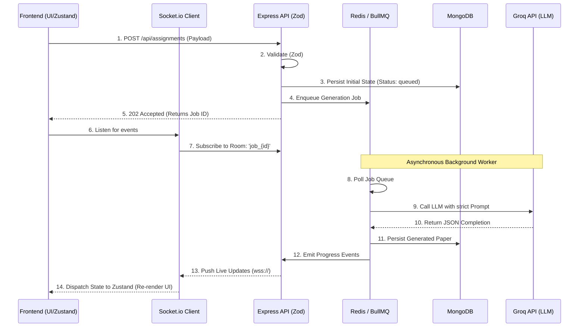
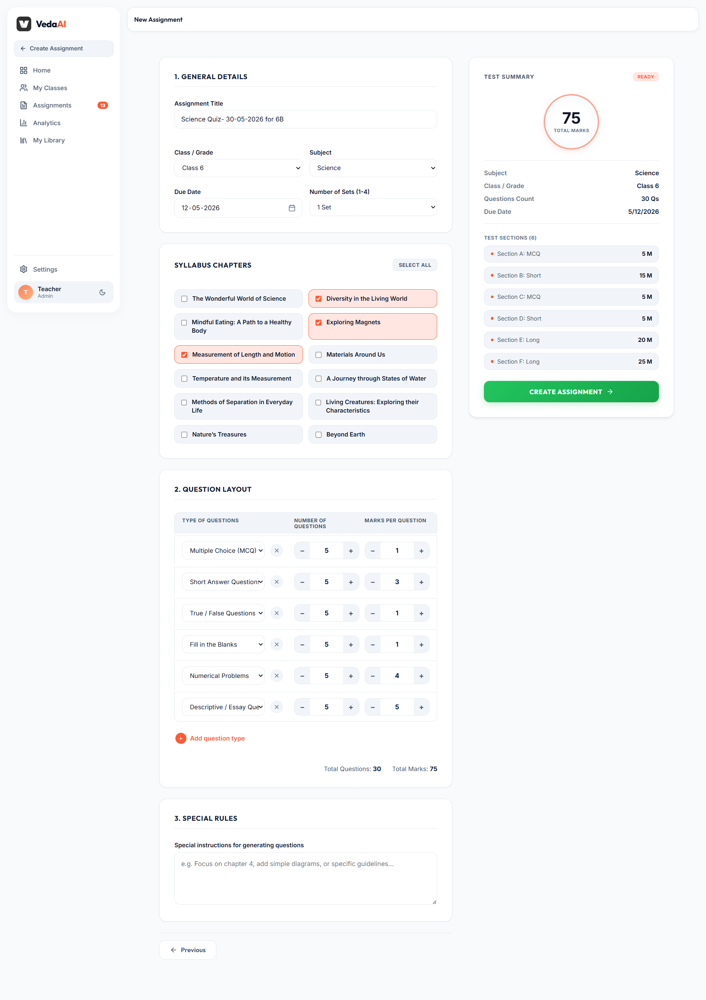
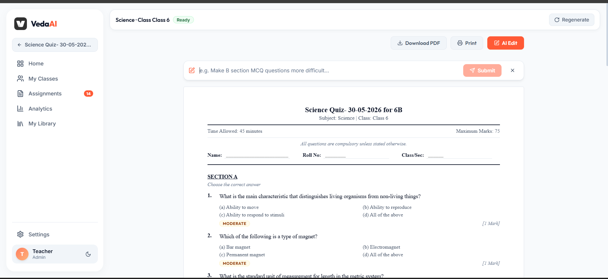
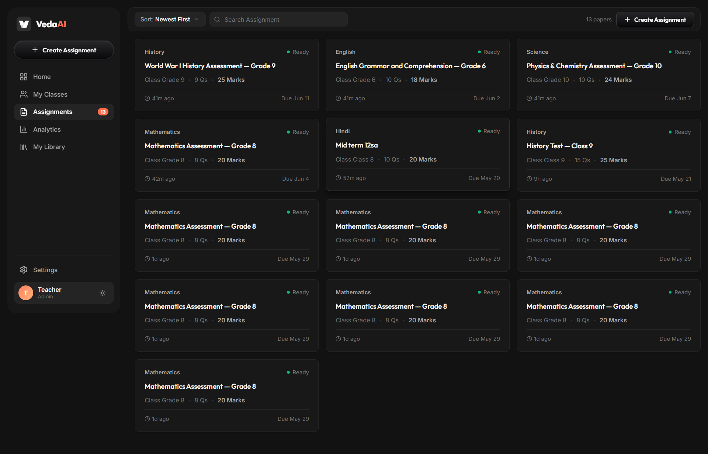

# VedaAI — The Next-Gen Assessment Engine

<div align="center">
  <p><strong>Building the future of modern classrooms. A lightning-fast, highly scalable, AI-powered assessment creator designed for speed and a seamless user experience.</strong></p>
  
  [](https://vedaai-rho.vercel.app)
  [](https://vedaai-backend.vercel.app)
</div>

---

## Live Demo

Hey there! Want to see VedaAI in action? Check out our live deployments:

- **Frontend Application:** [https://vedaai-rho.vercel.app](https://vedaai-rho.vercel.app)
- **Backend API:** [https://vedaai-backend.vercel.app](https://vedaai-backend.vercel.app)

---

## Features & Bonus Implementations

We didn't just build a simple assessment creator; we engineered a robust, production-ready platform that's built to scale. 

### Core Features
- **Dynamic Assignment Creation:** A sleek, comprehensive form that captures everything from subjects and grades to granular section configurations (MCQ, Short, Long).
- **AI-Powered Question Generation:** We supercharged our backend with **Llama-3.3-70b-versatile** via Groq to construct deeply structured, curriculum-aligned question papers.
- **Strict JSON Parsing:** We never render raw LLM text! The response is strictly formatted into clean JSON sections with precise titles, instructions, questions, and options.
- **Difficulty Tagging:** Every generated question comes with beautiful visual difficulty badges (Easy / Moderate / Hard) and assigned marks.
- **Structured Output Page:** A crystal-clear, hierarchical UI featuring a Student Info Section (Name, Roll No, Section) alongside gracefully formatted question sections.

### Bonus Features (High Signal)
- **High-Fidelity PDF Export:** We implemented server-side PDF generation using `PDFKit` to give educators pixel-perfect, printer-ready test papers. Say goodbye to messy `window.print()` hacks!
- **Real-Time Job Tracking:** Waiting on AI can be boring. We integrated **Socket.io**, **BullMQ**, and **Redis** to stream a live progress bar right to the user while the AI works its magic.
- **AI Edit & Granular Regeneration (Bonus):** We added an intuitive **Action Bar** that empowers educators to dynamically tweak specific questions or regenerate entire sections via a dedicated "AI Edit" mode.
- **Glassmorphic UI & Micro-animations:** Our frontend boasts a premium, "startup-vibe" interface using Vanilla CSS Modules for blazing fast, bloat-free styling.
- **Robust Edge Validation:** We use **Zod** at the edges to strictly validate all incoming API requests and parse AI outputs safely.

---

## Architecture Overview

To handle heavy LLM generation without timing out your browser, we designed a beautifully decoupled, event-driven architecture. We rely on **RESTful APIs** for quick state mutations and **WebSockets** for real-time bi-directional telemetry.

### System Architecture



### Detailed Frontend-Backend Connection Flow

To completely avoid those pesky timeout errors common in Serverless environments, we built an **Asynchronous Job Polling & Push Notification** loop:

1. **Initial Handshake (REST):** The Next.js frontend fires off a `POST` request with the user's assignment config. Our Express backend strictly validates it using **Zod**.
2. **Job Enqueueing:** Instead of making the user wait for the LLM to finish thinking, the backend immediately creates a skeleton record in **MongoDB** (`status: "queued"`), tosses a generation job into **Redis** via **BullMQ**, and happily responds with an HTTP 202 (Accepted) and the `assignmentId`.
3. **WebSocket Subscription (Real-time):** The moment the frontend gets that `assignmentId`, it uses `socket.io-client` to join a dedicated WebSocket room (`join_assignment: {id}`).
4. **Background Processing & Telemetry:** Our **BullMQ** worker grabs the job from Redis, builds a highly engineered prompt, and calls the **Groq API**. As it works (starting generation, validating JSON, saving to DB), it emits progress events to the **Socket.io Server**.
5. **Client-Side Hydration:** The Socket Server broadcasts these `progress_update` events over the `wss://` connection. **Zustand** catches them, updates the global store, and reactively re-renders the UI with a live progress bar. Once it gets the `completed` event, the frontend automatically fires a final REST `GET` request to fetch and render the masterpiece!

---

## Micro-Optimizations & SOLID Principles

We sweat the small stuff. To ensure VedaAI scales flawlessly, we implemented several advanced engineering techniques under the hood:

- **Optimistic UI & Skeleton Loaders:** Nobody likes a jarring layout shift. The frontend utilizes custom `SkeletonGrid` components to create a massive perceived performance boost, keeping the user engaged while data streams in.
- **Multi-Tier Caching Strategy:** Our backend features a robust TTL-based `MemoryCache` service. Highly requested, static-leaning endpoints (like dynamic syllabus fetching for grades, subjects, and chapters) are heavily cached, drastically reducing redundant database aggregations.
- **SOLID Design Principles:**
  - **Single Responsibility (SRP):** We strictly segregated our backend. `assignmentRoutes` handles pure HTTP boundaries, `aiService` encapsulates all Groq SDK interactions, and `generationWorker` is the boss of BullMQ job orchestration. 
  - **Dependency Inversion:** Controllers don't instantiate workers directly. They push abstract jobs to Redis, completely decoupling the fast web server from the heavy-lifting generation nodes.
- **Centralized Error Boundaries:** Zod edge validation errors and LLM hallucinations are safely caught and bubbled up to a centralized Zustand store. This gracefully dispatches non-intrusive Toast notifications to the user without ever crashing the React tree.

---

## The Stack

### Frontend (The Glassmorphic Shell)
- **Framework:** Next.js 14 (App Router)
- **State Management:** Zustand
- **Styling:** Vanilla CSS Modules with custom, beautiful design tokens
- **Real-Time:** Socket.io-client

### Backend (The Lean API Core)
- **Runtime:** Node.js + Express + TypeScript
- **Validation:** Zod
- **Database:** MongoDB (Native Mongoose)
- **Queue/Cache:** Redis + BullMQ (Scalable async generation)
- **AI Engine:** Groq SDK (Llama 3.3 70B)
- **Export:** PDFKit

---

## Local Setup Instructions

Want to run VedaAI locally? It's super easy!

### 1. Backend

```bash
cd backend
npm install

# Setup your environment variables
cp .env.example .env
# Ensure you add MONGO_URI, REDIS_URL, and GROQ_API_KEY to your .env

# Start the dev server (runs on port 5000)
npm run dev
```

### 2. Frontend

```bash
cd frontend
npm install

# Setup environment variables
# Create .env.local and add:
# NEXT_PUBLIC_BACKEND_URL=http://localhost:5000

# Start the Next.js frontend (runs on port 3000)
npm run dev
```

Visit [http://localhost:3000](http://localhost:3000) to see the magic.

---

## Future Roadmap

- **RAG Implementation:** We are planning an awesome integration of Retrieval-Augmented Generation (RAG). This will allow the AI to accurately pull specific context right from uploaded textbooks, notes, and custom curriculum documents for hyper-accurate, syllabus-specific question generation!

---

## Final Thoughts

This submission represents a true production-grade approach to the VedaAI assignment. It goes miles beyond a simple CRUD app by integrating resilient background processing, real-time feedback loops, and strict data validation at every single layer. 

Built with speed, stability, and massive scale in mind.

---

## Screenshots

### 1. Creating Assignment Page
<div align="center">
  
</div>

### 2. Generated Output Page
<div align="center">
  
</div>

### 3. Assignments Dashboard Page
<div align="center">
  
</div>
