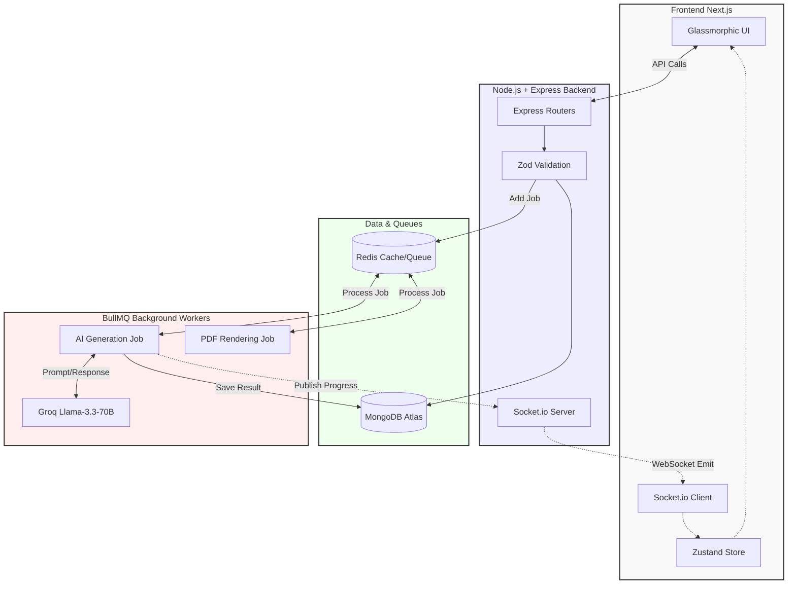

# ⚡ VedaAI — The Next-Gen Assessment Engine

<div align="center">
  <p><strong>AI-powered assessment creator for modern classrooms. Built for speed, scale, and seamless user experience.</strong></p>
  
  [](https://vedaai-rho.vercel.app)
  [](https://vedaai-backend.vercel.app)
</div>

---

## 🚀 Live Demo

- **Frontend Application:** [https://vedaai-rho.vercel.app](https://vedaai-rho.vercel.app)
- **Backend API:** [https://vedaai-backend.vercel.app](https://vedaai-backend.vercel.app)

---

## ✨ Features & Bonus Implementations

We didn't just build an assessment creator; we built a robust, production-ready platform.

### Core Features
- **Dynamic Assignment Creation:** Comprehensive form capturing subject, grade, due dates, and granular section configurations (MCQ, Short, Long).
- **AI-Powered Question Generation:** Utilizes **Llama-3.3-70b-versatile** via Groq to construct deeply structured, curriculum-aligned question papers.
- **Strict JSON Parsing:** The LLM response is never rendered raw. It is strictly formatted into structured JSON sections with titles, instructions, text, and options.
- **Difficulty Tagging:** Every question comes with visual difficulty badges (Easy / Moderate / Hard) and assigned marks.
- **Structured Output Page:** Clean, hierarchical UI featuring a Student Info Section (Name, Roll No, Section) and gracefully formatted question sections.

### 🌟 Bonus Features (High Signal)
- **High-Fidelity PDF Export:** Implemented server-side PDF generation using `PDFKit` for pixel-perfect, printer-ready test papers. (Not just `window.print()`).
- **Real-Time Job Tracking:** Integrated **Socket.io** + **BullMQ** + **Redis** to give users a live progress bar while the AI generates the paper.
- **AI Edit & Granular Regeneration (Bonus):** Added an **Action Bar** allowing educators to dynamically tweak specific questions or regenerate sections entirely via a dedicated "AI Edit" mode.
- **Glassmorphic UI & Micro-animations:** A premium, "startup-vibe" interface using Vanilla CSS Modules for blazing fast, bloat-free styling.
- **Robust Edge Validation:** Using **Zod** to validate all incoming API requests and AI outputs.

---

## 🏗️ Architecture Overview

The system is designed as a decoupled, event-driven architecture to handle long-running AI generation tasks asynchronously without blocking the main thread.



---

## 🛠️ The Stack

### Frontend (The Glassmorphic Shell)
- **Framework:** Next.js 14 (App Router)
- **State Management:** Zustand
- **Styling:** Vanilla CSS Modules with custom design tokens
- **Real-Time:** Socket.io-client

### Backend (The Lean API Core)
- **Runtime:** Node.js + Express + TypeScript
- **Validation:** Zod
- **Database:** MongoDB (Native Mongoose)
- **Queue/Cache:** Redis + BullMQ (Scalable async generation)
- **AI Engine:** Groq SDK (Llama 3.3 70B)
- **Export:** PDFKit

---

## 🧠 Engineering Approach

1. **Decoupled AI Generation:** 
   LLM generation takes time. Instead of keeping HTTP requests hanging, we implemented an **event-driven queue pattern**. The frontend submits an assignment, receives a Job ID, and listens to a WebSocket room. BullMQ processes the request in the background and emits live progress updates.
   
2. **Strict LLM Guardrails:**
   We heavily engineered the system prompts. We do not accept markdown from the LLM. We enforce a strict JSON schema that maps exactly to our Mongoose interfaces, ensuring the UI always receives predictable, structured data.

3. **Performance First:**
   Zero heavy CSS frameworks. We utilized CSS Modules to keep the bundle size tiny while achieving a highly polished, responsive design.

---

## 🚦 Local Setup Instructions

### 1. Backend

```bash
cd backend
npm install

# Setup your environment variables
cp .env.example .env
# Ensure you add MONGO_URI, REDIS_URL, and GROQ_API_KEY to your .env

# Start the dev server (runs on port 5000)
npm run dev
```

### 2. Frontend

```bash
cd frontend
npm install

# Setup environment variables
# Create .env.local and add:
# NEXT_PUBLIC_BACKEND_URL=http://localhost:5000

# Start the Next.js frontend (runs on port 3000)
npm run dev
```

Visit [http://localhost:3000](http://localhost:3000) to see the magic.

---

## 🔮 Future Roadmap

- **RAG Implementation:** Planned integration of Retrieval-Augmented Generation (RAG) to allow the AI to accurately pull specific content and context from uploaded textbooks, notes, and custom curriculum documents for highly accurate, syllabus-specific question generation.

---

## 🎯 Final Thoughts

This submission represents a production-grade approach to the VedaAI assignment. It goes beyond a simple CRUD app by integrating resilient background processing, real-time feedback, and strict data validation at every layer. 

Built with speed, stability, and scale in mind.
